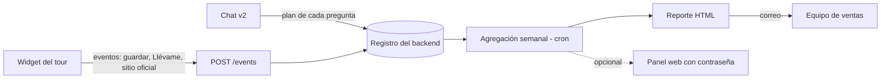

# Analítica del asistente y de «Mi lista» — propuesta

**Para qué:** que el equipo de ventas de Febal sepa qué buscan y qué guardan los visitantes del tour, con un correo periódico. Ejemplo: «esta semana 25 visitantes buscaron el Balmoral, 35 pidieron piel y 15 un estilo minimalista».

Reporte de ejemplo, generado con los datos de las pruebas de estos días: `~/Downloads/febal-casa-reporte-ejemplo.html` (lo genera `node scripts/analytics-sample-report.mjs`).

---

## 1. Qué se mide

| Tema | Qué dice | De dónde sale |
|---|---|---|
| Qué buscan | Tipo de mueble, material, color, estilo y ambiente pedidos | Ya se registra: el plan de cada pregunta (`server/data/v2-turns.jsonl`) |
| Lo que falta | Lo que pidieron y no está así en el showroom (se ofreció bajo pedido o una alternativa) | Ya se registra (resultado de cada búsqueda) |
| Piezas | Qué piezas mostró el asistente y a cuáles llevó al visitante | Ya se registra |
| Idiomas | En qué idioma conversan | Ya se registra |
| «Mi lista» | Qué guardan y qué quitan; qué piezas llegan juntas a una lista | **Nuevo:** eventos desde el widget |
| Clics | «Llévame», «Sitio oficial», «Ver alternativas», abrir el chat o la lista | **Nuevo:** eventos desde el widget |
| Moodboard | Cuántos se crean y de qué estilo | Ya se registra (caché del moodboard) |
| Contactos | Cuántas listas se envían y a qué tienda | **Nuevo**, cuando «Contáctame» envíe de verdad |
| Embudo | Visita → chat → tarjeta → lista → contacto | Combinación de lo anterior |

El chat ya guarda, por cada pregunta, lo que el asistente entendió en conceptos cerrados («sofá», «piel», «azul»). Eso hace el conteo exacto y comparable entre idiomas: «cuero», «pelle» y «leather» cuentan igual.

## 2. Arquitectura propuesta

- **Eventos:** `POST /events` en el mismo backend, enviados con `navigator.sendBeacon`. Pesan poco y no frenan el tour. Llevan solo el id de sesión aleatorio por visita, el tipo de evento y el id de pieza.
- **Almacenamiento:** SQLite en la instancia EC2 que ya existe (o JSONL, como hoy). Suficiente para miles de visitas al mes.
- **Agregación:** un cron semanal, o cada N visitas si lo prefieren, que cuenta por concepto, pieza y tienda.
- **Correo:** HTML como el ejemplo, en italiano para Febal, con un proveedor europeo (Brevo o Mailjet: plan gratuito de unos cientos de correos al día).
- **Opcional:**
  - un panel web con contraseña, para ver cualquier rango de fechas;
  - un párrafo de «lectura» escrito por gpt-4o-mini con las cifras del reporte («subió la demanda de piel en sofás»).

**Alternativa detectada:** el tour ya carga Google Analytics 4 (lo incluye el export de 3DVista). Los mismos eventos se pueden mandar a GA4 y armar el reporte en Looker Studio. Es más barato de construir, pero:
- el análisis de lo que se pide (conceptos) seguiría viviendo en nuestro backend;
- en Italia, GA4 necesita el banner de consentimiento, porque el Garante lo trata con cautela desde 2022.

Recomendación: backend propio para los conceptos y eventos del asistente; GA4 se deja para el tráfico general del tour.

## 3. Privacidad (Italia, GDPR)

- Sin datos personales en la analítica: id de sesión aleatorio por carga de página, sin rastreo entre visitas ni cookies propias de seguimiento.
- Se guardan los **conceptos** (lo que entendió el asistente), no el texto libre. Si Febal quiere el texto libre, que sea con retención corta (30 días) y mencionado en la informativa privacy.
- Métricas propias, agregadas y anonimizadas: según las directrices del Garante sobre cookies (2021), se pueden asimilar a técnicas y no piden consentimiento. **Validarlo con el DPO de Febal.**
- Los contactos de «Contáctame» (nombre, correo, CAP) no entran en la analítica: solo se cuenta un envío por tienda.

## 4. Esfuerzo estimado

| Bloque | Horas |
|---|---|
| Ruta `/events` y eventos del widget (lista, clics, chat, moodboard) | 6–8 |
| Almacenamiento (SQLite) y agregación por concepto, pieza y tienda | 6–8 |
| Reporte por correo: plantilla en italiano, proveedor, programación, destinatarios por tienda | 8–10 |
| Pruebas, revisión de privacidad y documentación | 4–6 |
| **Núcleo (sin panel)** | **24–32 h (3–4 días)** |
| Panel web opcional (rangos de fechas, filtros, exportar CSV) | 12–16 |
| **Con panel** | **36–48 h (5–6 días)** |

**Costo mensual de operación** (con el backend actual):

| Concepto | Costo |
|---|---|
| Correo (Brevo o Mailjet, plan gratuito) | $0 |
| Almacenamiento | Despreciable |
| Párrafo de lectura con gpt-4o-mini (opcional) | ≈ $0,01 por reporte |

El precio al cliente sale de estas horas por la tarifa que se defina.

## 5. Demo propuesta

- **Qué es:** 1–2 días. Durante la PoC se registran las visitas reales del tour y cada lunes llega a un correo de Febal el «reporte de la semana» con el formato del ejemplo.
- **Qué incluye:** los eventos de «Mi lista» y los clics, porque son lo que más interesa a ventas.
- **Qué no incluye:** el panel.
- **Para enseñarlo antes:** el ejemplo de `~/Downloads/febal-casa-reporte-ejemplo.html` ya muestra cómo se vería, con los datos de las pruebas internas.
