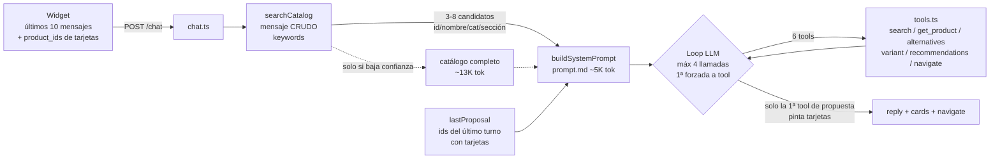

# 01 — Análisis de la arquitectura actual del chatbot Febal Casa (Objetivo 1)

> Fecha: 2026-09-22/23 · Estado del código: working tree de `main` (diff grande sin commitear, ver `HANDOFF_FEBAL_CASA.md`).
> Cada afirmación lleva `archivo:línea`, contrastada contra el código real en esta sesión. Para regenerar números de cobertura, ver la sección "Cómo reproducir" al final.

## 0. Resumen ejecutivo

- **El reporte de Andrea ("pedí un sofá de cuero y no me mostró nada") no lo causó un modelo que alucinara ni un bug aislado.** Se juntan tres cosas:
  1. **El dato no existe.** Ningún sofá tiene "pelle" en ningún campo. Además, según la web oficial, ninguno de los 4 sofás se ofrece en piel.
  2. **El motor no entiende sinónimos ni relaja el material.**
  3. **El modelo de datos no distingue la *pieza expuesta* de las *opciones bajo pedido*.**
- **La respuesta correcta era una alternativa honesta, no "no tengo".** Por ejemplo: *"ninguno de nuestros sofás se ofrece en piel; el Balmoral se puede pedir en Nabuk Eagle, acabado tipo nobuk… ¿te lo muestro?"*.
- **La arquitectura es de tipo "recuperación por keywords + ~20 reglas-parche en el prompt".** Con 88 piezas, el catálogo completo cabe en contexto (~25K tokens con todos los campos). **Los cuellos de botella son dos:**
  1. **Datos faltantes:** 66/88 piezas sin color, 67/88 sin material y 0/88 con sinónimos.
  2. **Una capa de keywords que decide qué ve el LLM.** Esa capa mete ruido, casi nunca activa el respaldo del catálogo completo, compara por igualdad exacta y sus instrucciones contradicen al prompt.
- **Los casos de uso pedidos son imposibles con la estructura actual:**
  - la variante sobre el producto en foco;
  - la relajación jerárquica sofá + ángulo + amarillo con "combina con";
  - varios grupos de tarjetas con motivo en la misma respuesta.

  Faltan estado conversacional, datos bajo pedido, armonía de color, y la orquestación solo permite **una** herramienta de propuesta con tarjetas por turno.

---

## 1. ¿Por qué "sofá de cuero" no mostró nada? (cadena causal completa)

| # | Eslabón | Evidencia |
|---|---|---|
| 1 | **Dato inexistente.** 0 de los 4 sofás activos tienen "pelle"/"cuoio" en ningún campo. Solo 21/88 piezas tienen `materials`. | `clients/febal-casa/catalog.json`. Sofás: Balmoral `["tessuto"]`; Camden, Melrose y Navigli `[]`. |
| 2 | **No es una pérdida del pipeline: el dato nunca se capturó.** El scraper guardaba solo descripción e imagen, nunca la sección Rivestimenti. | `scripts/scrape-febal-products.py` (docstring de cabecera) y `tour-project/febal-casa/scraped-products.json` |
| 3 | **La web oficial confirma que no hay piel.** Balmoral, Camden, Melrose y Navigli listan 10–11 colecciones de tapizado de 8–24 colores cada una (Boston, Velvet, Campsbay, Rimini, Cavaliere, Jolie…), sin piel. **Nabuk Eagle** aparece en Balmoral y en las poltronas Astor y Vivienne (hay que confirmar si es piel real o microfibra). Los armarios ofrecen **Similpelle Inca** (efecto piel). | Sondeo de las 57 fichas del 2026-09-22 (sección 9) |
| 4 | **El motor compara el filtro `material` por igualdad exacta.** | `packages/catalog-engine/src/matching.ts:4-7` (`fieldMatches`) y `packages/catalog-engine/src/search.ts:90-92` |
| 5 | **No hay sinónimos.** `synonyms` se escribe siempre vacío. La tabla de sinónimos existe pero nunca se usa en filtros. | `scripts/build-febal-catalog.mjs:274`, `packages/catalog-engine/src/synonyms.ts` |
| 6 | **Solo se relaja el color.** Si `material` no encuentra nada, no hay "lo más cercano". | `server/src/agent/tools.ts:172-190` (el `color_fallback` es el único) |
| 7 | **El modelo de datos no conoce las opciones bajo pedido.** Un registro describe la pieza expuesta y a la vez "el producto". | `packages/catalog-engine/src/schema.ts:8-76` |

**Consecuencia.** Aunque un sofá se fabricara en piel, el sistema no podría saberlo. Y aunque el LLM razonara perfecto, solo puede decir "no tengo".

**Hallazgo del mismo tipo.** **Melrose** tiene `shape: "ad angolo"` y **sí se puede pedir en amarillo** (Boston *Mustard*, Rimini *Sunflower*, Velvet *Curry*). Así que "sofá de ángulo amarillo" tiene una respuesta positiva *bajo pedido* que hoy es invisible.

---

## 2. El flujo real, paso a paso

1. **El widget** envía los últimos 10 mensajes (`packages/assistant-ui/src/chat-card.ts:208`). A los mensajes del asistente que mostraron tarjetas les agrega `product_ids` (`:213`).
2. **La ruta** `server/src/routes/chat.ts` recibe `message`, `history` y `wishlist_product_ids`. No hay campo para "qué pieza mira el visitante en el tour" ni para restricciones activas.
3. **Pre-búsqueda sobre el mensaje crudo:** `searchCatalog(message, {}, catalog)` (`server/src/agent/orchestrator.ts:109`).
4. **System prompt** (`server/src/agent/system-prompt.ts:63-115`):
   - `prompt.md` completo (~18K caracteres ≈ 5K tokens);
   - el catálogo completo en JSON *pretty-printed*, **solo si hubo baja confianza** (`:72-82`);
   - 3–8 candidatos con `id/name/category/section` (`:84-91`);
   - la línea "en tu turno anterior propusiste…" (`:93-99`);
   - la wishlist (`:101-112`).
5. **Loop** (`orchestrator.ts:152-227`): hasta `MAX_TOOL_TURNS = 4` llamadas (`:19`). La primera va con `tool_choice: "required"` (`:162`).
   - Se re-fuerza **solo** si una tool devolvió `low_confidence` o `color_fallback` (`:194-196`).
   - **Solo la primera tool de propuesta que devuelve tarjetas las muestra**; las siguientes se descartan (`:209-218`).
   - Si se agotan las vueltas, responde un error fijo **en español** (`:229-236`).
6. **Proveedores** (`server/src/config.ts:17`): `openai` (por defecto, `gpt-4o-mini`), `anthropic` (raw, **sin `cache_control`** en `packages/model-adapters/src/anthropic-adapter.ts`) y `claude-code` (Agent SDK, `maxTurns: 10` en `server/src/agent/claude-code-orchestrator.ts:82`).
7. **Sin estado en el servidor:** cada request es independiente (lo dice el propio comentario en `system-prompt.ts:28-30`).

**Herramientas** (`server/src/agent/tools.ts`):

| Tool | Qué hace | Nota crítica |
|---|---|---|
| `search_catalog` | Hasta 8 candidatos. Con menos de 2 matches agrega `low_confidence` + catálogo compacto. Si el filtro `color` dio 0, reintenta sin color y agrega `color_fallback` (`:172-190`). | Es la única relajación que existe. |
| `get_product` | Devuelve descripción, style, shape, materials, finish, `compatible_with_names` y 1 tarjeta. | |
| `get_alternatives` | Mismo `alternatives_group` (= categoría), sin duplicados, ordenado por `rankBySimilarity`, máximo 5. | La preferencia de color está invertida (sección 3.C). |
| `get_recommendations` | Por wishlist: +5 por `compatible_with`, +2 por estilo, +1 por material o color compartido. | `compatible_with` es heurístico (3.A). |
| `get_product_variant` | "Hermanos" = mismo `name` exacto (`packages/catalog-engine/src/variants.ts:34`). | Los 4 sofás solo se tienen a sí mismos. |
| `navigate_to_product` | Devuelve la cámara, **sin tarjeta** (`tools.ts:317-325`). | Por eso el siguiente turno pierde el ancla. |

---

## 3. Causas raíz por capa

### A. Datos (la causa n.º 1)

**Cobertura de las 88 piezas activas:**

| Campo | Con dato | Nota |
|---|---|---|
| colors | 22 | Texto libre compuesto: "marmo marrone scuro venato", "greige/tortora" |
| materials | 21 | |
| finish | 14 | |
| shape | 13 | Navigli ni siquiera tiene la clave |
| style | 82 | Inferido por keywords del texto de marketing (`scripts/enrich-febal-style-compat.mjs`) |
| compatible_with | 58 | Heurística: misma panorámica, otra categoría. **No** es un emparejamiento de diseño real |
| synonyms | **0** | El build lo reescribe vacío cada vez (`build-febal-catalog.mjs:274`) |
| dimensiones | — | **El campo no existe** en `schema.ts` |
| image_url | 88 | **37 son placeholder**, así que salen tarjetas sin foto real |
| description | 88 | 13 son la frase genérica de respaldo |

**Problemas estructurales:**
- **Pieza expuesta = modelo.** No hay dónde guardar "este sofá se fabrica en 11 colecciones × N colores".
- **Colores sin normalizar.** Filtrar `color:"marrone"` no encuentra "marmo marrone scuro venato". `COLOR_FAMILIES` (`packages/catalog-engine/src/color-families.ts:22-31`) es una tabla semilla inventada: no tiene amarillo ni el italiano "marrone" (solo el español "marron"), y de 19 valores reales solo agrupa 3.
- **El enriquecimiento vive solo en `catalog.json`.**
  - Se preserva entre builds por una llave natural hotspot + nombre (`build-febal-catalog.mjs:50-55`); si renombras una fila, se pierden sus datos.
  - Un campo no se puede vaciar reconstruyendo.
  - `xlsx-to-json.mjs` no maneja `compatible_with`, así que la ida y vuelta por Excel lo borra.
- **Duplicados.** 88 filas = 60 nombres = 57 URLs. El LLM tiene que desambiguar duplicados sin datos que los distingan.
- **Datos de prueba.** FEB-026/027 (Camden) se sembraron para probar y nunca se verificaron.

### B. Recuperación / búsqueda
- **La pre-búsqueda usa el mensaje crudo** (en español) contra un catálogo en italiano (`orchestrator.ts:109`).
- **Ruido de 2 letras.** Los tokens de 2 letras cuentan como match por substring: "de", "un", "lo", "en" (`search.ts:49-52`, con `token.length < 2` como único corte).
  - Ejemplo: "quiero un sofá de cuero" devuelve 3 sofás más 5 productos irrelevantes, y no se considera baja confianza.
  - Resultado: el catálogo completo (el respaldo que sí tiene los atributos) **casi nunca llega** al LLM.
- **Igualdad exacta sin enum en category, section, color, material y finish** (`matching.ts:4-7`). Los schemas no declaran valores permitidos (`packages/model-adapters/src/tool-schemas.ts:20-22`). Por eso "divano", "cucina", "cocina" y "marrone" dan 0.
- **Filtro + query que no puntúa descarta productos válidos** (`search.ts:127-129`). Ejemplo: query "esquinero" + shape "angolo" hace que los sofás de ángulo reales se descarten con score 0.
- **1 solo match exacto se trata como baja confianza** (`search.ts:133`, `MIN_REAL_MATCHES = 2`). Eso inyecta ~12K tokens sin necesidad.
- **La descripción no se busca;** solo sus 12 palabras más frecuentes pasan a keywords (`build-febal-catalog.mjs:164`). Ejemplo: "inserto in pelle" de FEB-050 quedó fuera del corte.

### C. Contrato de herramientas y prompt
- **Contradicción directa sobre el idioma de los argumentos.**
  - `tool-schemas.ts:19` pide `query` *"en español, tal como lo escribió el usuario"*; la regla 10b (`clients/febal-casa/prompt.md:39`) exige argumentos en italiano.
  - `requested_value` dice *"tal como los escribió"* (`tool-schemas.ts:110` y regla 14, `prompt.md:46`).
- **Orden invertido en "¿en otro color?".** `preferred_attribute:"color"` suma peso al candidato que comparte el **mismo** color del ancla (`packages/catalog-engine/src/similarity.ts:42`). Pero la regla 15 (`prompt.md:48`) lo manda usar justamente para "¿tienes esta mesa en otro color?".
- **Prompt de ~20 reglas-parche** (numeradas 1–15 más 6 "críticas"), cada una nacida de un bug en vivo. Algunas chocan: la regla 14 prohíbe llamar a `search_catalog` antes de `get_product_variant`, así que el bot **nunca** propone "el sofá café de otro modelo".
- **Schemas de tools duplicados** en `tool-schemas.ts` y `server/src/agent/claude-code-tools.ts`. Hay riesgo de que diverjan.
- **Referencia rota:** `orchestrator.ts:142` cita una "regla 22" que no existe.

### D. Estado conversacional
- **El único ancla es `lastProposal`** (`orchestrator.ts:94-100`): los ids de la **última** respuesta *con tarjetas*. Se pierde:
  - después de "Llévame" (navigate no genera tarjeta, `tools.ts:324`);
  - después de una respuesta solo de texto;
  - si el visitante miró la pieza en el tour y no en el chat (no existe `focus_product_id`);
  - si hubo "Ver alternativas" con 5 ids (la regla 14 obliga a preguntar cuál).
- **No existen "restricciones activas"** (sofá + ángulo + amarillo) **ni detección de cambio de tema.** Todo depende de que el LLM relea los 10 mensajes, y nada reinicia el contexto cuando el visitante dice "cocinas".

### E. Orquestación y UI
- **Una sola tool de propuesta con tarjetas por turno** (`orchestrator.ts:209-218`). La respuesta que pide el caso de uso (grupo "ángulo café" + grupo "amarillo sin ángulo") es **estructuralmente imposible**.
- **Las tarjetas no llevan motivo.** `ProductCardPayload` (`tools.ts:15-34`) no tiene un campo de coincidencia o diferencia ("de ángulo · café", "amarillo · no de ángulo").
- **`found:false` en una variante no fuerza propuesta** (`orchestrator.ts:194`). La respuesta puede terminar con 0 tarjetas.
- **La relajación es de un solo paso** (quitar color). No hay jerarquía configurable ni "combina con" cromático.

### F. Modelo
Mediciones del prototipo (`fase2-full-dataset.json`, `ux-report.html`, `HANDOFF_FEBAL_CASA.md:94-99`):

| | gpt-4o-mini | Sonnet 5 | Haiku 4.5 |
|---|---|---|---|
| Costo/turno | $0.0014 | ≈$0.013 (API directa, estimado) | ≈$0.0066 (estimado) |
| Latencia | 3.4–3.6 s | 16–20 s* | 18–29 s* |
| Observado | Falla reglas finas: inglés, cambio de idioma, nombrar valores reales, disciplina de tools | El más preciso en forma, acabado y color | 2× HTTP 502 en 8 turnos; filtró una instrucción interna |

\* Medido vía Agent SDK con sobrecarga; no representa la API directa.

**Ningún modelo puede responder lo que no está en los datos.** Y ninguno puede filtrar exhaustivamente si solo ve 3–8 candidatos sin atributos.

### G. Calidad y operación
- **0 tests automáticos** (no hay vitest/jest ni `*.test.*`). Las baterías (`scripts/fase2-comparison-battery.mjs`, `server/live-test-*.mjs`) se evalúan a mano y usan ids viejos (`box-…`).
- **Despliegue y configuración:**
  - un backend por tour (`TOUR_ID`);
  - CORS acepta un solo origen (`ALLOWED_ORIGIN`);
  - `clients/febal-casa/tour.config.json` apunta a `http://localhost:8961` en el working tree.
- **Git:** diff grande sin commitear.

---

## 4. Casos de uso frente al estado actual

| Caso | Hoy | Capa que falla |
|---|---|---|
| Material con sinónimo ("sofá de cuero / de piel") | ❌ | A, B, C |
| "¿Lo tienes en café?" sobre el producto en foco | ❌ solo funciona si el nombre es idéntico y el color exacto | A, D, E |
| Ángulo + amarillo con relajación jerárquica y "combina con" | ❌ | A, D, E |
| Varios grupos de tarjetas con motivo en una respuesta | ❌ | E |
| Cambio de tema ("cocinas") | ⚠️ funciona porque no hay estado; puede arrastrar restricciones vía el historial | D |
| Forma con sinónimos (esquinero, en L, angolare) | ⚠️ solo "angolo" / "ad angolo" | B, C |
| Mesa redonda | ✅ tras el fix de datos (trailing space) | — |
| "¿Tienes esta mesa en otro color?" | ⚠️ orden invertido | C |
| Variante después de navegar | ❌ se pierde el ancla | D |
| Multi-idioma / cambio de idioma | ⚠️ depende del modelo | F |
| Recomendación por wishlist | ⚠️ sobre `style`/`compatible_with` heurísticos | A |
| Medidas / "algo pequeño" | ❌ no hay dato | A |
| "Muéstrame todos los sofás" | ⚠️ 1 tarjeta + nombres en texto | E |

---

## 5. Qué no resuelve el determinismo actual, y qué no resuelve el LLM

**El determinismo actual (código) no resuelve:**
- vocabulario abierto y sinónimos en varios idiomas ("rinconero", "tipo L", "que no ocupe mucho");
- anáforas ("ese", "el de la foto", "el que estoy viendo");
- clasificar la intención: variante, búsqueda nueva, refinamiento o cambio de tema;
- juicios estéticos ("qué combina con amarillo") y peticiones vagas ("algo acogedor");
- redactar una respuesta con varios grupos y explicar por qué propone cada cosa.

**El LLM (cualquier modelo) no resuelve:**
- datos ausentes (piel, amarillo, medidas);
- ver qué mira el visitante en el tour;
- filtrar de forma exhaustiva cuando solo ve 3–8 candidatos con nombre;
- garantizar consistencia sobre ~20 reglas en conflicto (sobre todo los modelos chicos);
- validar coordenadas (esto está vetado a propósito, y es correcto).

**Conclusión.** El problema no es "determinismo vs LLM" sino que **ninguno de los dos tiene lo que necesita**:
- El LLM ve un recorte ruidoso sin atributos.
- El código no tiene estado, ni jerarquía, ni datos bajo pedido.

Con 88 piezas, dar al LLM el catálogo completo estructurado (~25K tokens, cacheable), un estado conversacional explícito y una verificación determinista de su salida es viable en costo. **Esa decisión corresponde al Objetivo 3.**

---

## 6. Escalabilidad y reutilización (insumo para el Objetivo 6)

| Pieza | Reutilizable | Acoplamiento |
|---|---|---|
| `packages/model-adapters` (`ModelProvider`, adaptadores) | ✅ | Los schemas de tools están en español y nombran líneas de Febal |
| Loop de tools (`server/src/agent/orchestrator.ts`) | ✅ con ajustes | 3 rutas de orquestación duplicadas |
| `packages/assistant-core` (chat, sesión, wishlist) | ✅ | Solo prefijos de storage |
| `packages/catalog-engine` | ⚠️ | El schema exige cámara 3DVista; `finish` y `COLOR_FAMILIES` son vocabulario Febal |
| `packages/assistant-ui` | ⚠️ | Textos en italiano sin i18n; el corazón sobre hotspots depende del canvas de 3DVista |
| `packages/tour-bridge` + `product-panel.ts` | ❌ | 100% 3DVista y nombres de hotspot Febal. La costura natural es la interfaz `TourBridgeStrategy` |
| `server/` | ⚠️ | Un backend por tour (`TOUR_ID`); CORS de un origen; prompt por cliente |
| Scripts de pipeline (`scripts/*febal*`) | ❌ | Por cliente, con el enriquecimiento guardado en el artefacto de salida |

---

## 7. Quick-wins detectados (NO implementados; los decide la sesión 3)

1. Alinear `tool-schemas.ts` y `claude-code-tools.ts` a argumentos en italiano, coherentes con la regla 10b.
2. Quitar stopwords y tokens de 2 letras del scoring (`search.ts:49-52`).
3. Enums de `category`/`color`/`material` en los schemas; match por token dentro de valores compuestos.
4. Invertir o parametrizar la preferencia de color para "otro color" (`similarity.ts:42`).
5. Hacer que `found:false` de una variante fuerce una propuesta (`orchestrator.ts:194`).
6. Enviar `focus_product_id` desde el tour y después de navegar.
7. Poner `cache_control` en el adaptador Anthropic.
8. Serializar el catálogo compacto (no *pretty*) en `system-prompt.ts:80` (~20% menos tokens).

---

## 8. Tamaño de contexto (para la decisión de modelo)

| Bloque | Tamaño | ≈ tokens |
|---|---|---|
| `prompt.md` | 18.2K caracteres | ~5K |
| 6 schemas de tools | — | ~1.3K |
| Candidatos (hasta 8) | 1.1K caracteres | ~300 |
| Catálogo completo en el system prompt, *pretty* (solo con baja confianza) | 46.7K caracteres | ~13–14K |
| Catálogo compacto dentro de un resultado de tool | 39K caracteres | ~11–12K |
| Catálogo activo completo, todos los campos | 82.6K caracteres | ~25K |

- **Turno normal:** 15–20K tokens de entrada (2–3 llamadas).
- **Peor caso** (catálogo en el prompt + en un resultado de tool, reenviado en cada vuelta): 70–100K tokens por turno de usuario.

---

## 9. Datos oficiales disponibles en febalcasa.com (sondeo del 2026-09-22, 57 fichas)

- **Las fichas son HTML estático con los acabados dentro.** Hay dos formatos de marcado; ambos usan `ul.list--materials`.
- **42 de 57 fichas traen acabados o tapizados:**
  - **Sofás, poltronas y camas:** colecciones de tapizado, a veces por categoría de precio (p. ej. "NAVIGLI - CAT. 1/2/3").
  - **Armarios, cocinas, madie y mesas:** grupos por material (LACCATO OPACO/LUCIDO, IMPIALLACCIATO, SIMILPELLE INCA, GRES, VETRI, METAL SKIN, NOBILITATO, CRISTALLO, SUPERMARMO, SUPERCERAMICA…).
  - Cada color trae nombre, código y una miniatura `-1x1.jpg` (un píxel con el color medio).
- **15 de 57 fichas no traen acabados:** Rio, Libreria Lapis, Windsor, Ink, Lavanderia (Momenti), Polar, Andy, Nina, Camerette, Leeds, Nives, Lola, Dea, Daniel y Armadio con passaggio. Para esas piezas solo quedan la observación en el tour y Andrea.
- **Ninguna ficha indica qué acabado tiene la pieza de la foto.** Por eso el color de la pieza expuesta se obtiene observándola en el tour.
- **Hay medidas en cm solo en algunas fichas:** cocinas Origina/Modula, Madia Onda, Isola Onda, Madie Libeskind022 y camas.
- **Piel:** ningún sofá la ofrece.
  - Nabuk Eagle aparece en Balmoral, Astor y Vivienne; pendiente confirmar con Andrea si es piel.
  - Armarios: Similpelle Inca (efecto piel), más el acabado interior "Leather Grey".

## Cómo reproducir
- **Cobertura:** `node -e` sobre `clients/febal-casa/catalog.json` filtrando `active`.
- **Tokens:** longitud del JSON / 3.4.
- **Fichas:** `curl` a cada `detail_url` único, contando `class="list--materials"`. El pipeline formal de captura está en `datos-captura-estado.md`.
