# Moodboard de la wishlist

El visitante guarda productos en "La mia collezione". La wishlist ya le dice **su estilo** ("Il tuo stile: Contemporaneo"). El moodboard convierte ese estilo en algo visual:

- la **foto real** de 1 o 2 productos guardados que mejor representan ese estilo;
- **lema**, **descripción** y **paleta de 6 colores**, generados;
- **4 texturas de materiales**, generadas.

Viene del experimento [moodboard-ai](https://github.com/lo503858-uaeh/moodboard-ai) (dos IAs encadenadas). Aquí se integra sin su UI de desarrollo: no hay selectores de modelo ni costes a la vista. Los modelos se fijan en el servidor.

> Estado: integrado en la rama `chatbot-v2`, activado solo en `febal-casa` (`features.moodboard`). El chatbot no se tocó.

---

## 1. De dónde sale el estilo (y por qué es siempre el mismo que muestra la wishlist)

1. `scripts/enrich-febal-style-compat.mjs` etiqueta cada producto con **hasta 2 estilos** de un vocabulario cerrado de 4: `Minimal`, `Contemporaneo`, `Classico elegante` y `Caldo accogliente`.
   - Las etiquetas salen de palabras clave de la descripción oficial del producto.
   - Se ordenan por número de coincidencias, así que **la primera es la más fuerte**.
   - Si la descripción no tiene adjetivos, se usa un valor por defecto según la categoría.
2. `computeStyleProfile` ([`catalog-engine/src/recommendations.ts`](../../packages/catalog-engine/src/recommendations.ts)) cuenta esas etiquetas en los productos guardados y gana la más repetida. En caso de empate gana la que apareció antes. Es estadística pura, sin IA.
3. El panel de la wishlist lo pide a `POST /recommendations`. El moodboard lo pide a `POST /moodboard`. **Las dos rutas llaman a la misma función con el mismo catálogo** (`loadCatalog()`), así que el estilo no puede diferir.
   - Verificado en vivo: la misma wishlist da "Contemporaneo" en ambas rutas.
   - Un test (`packages/moodboard-engine/test`) comprueba con el catálogo real que, para cada uno de los 4 estilos, las anclas elegidas llevan el estilo que calcula `computeStyleProfile`.

El moodboard **nunca inventa ni renombra el estilo**: el prompt lo recibe como un dato cerrado.

Hoy la distribución está muy sesgada: `Contemporaneo` aparece en 65 de los 88 productos activos, así que la mayoría de wishlists saldrán "Contemporaneo". Diversificarla es trabajo de datos (enriquecimiento con Andrea), no del moodboard.

## 2. Qué productos "determinan" el estilo (las anclas)

`pickStyleAnchors` ([`select-anchors.ts`](../../packages/moodboard-engine/src/select-anchors.ts)) elige 1 o 2 productos guardados:

| Regla | Por qué |
|---|---|
| Solo productos etiquetados con el estilo dominante | Son los que lo determinan |
| Primero los que tienen **foto real** | Una pieza sin foto solo tiene el logo de Febal como imagen. Mandárselo al modelo pintaría la paleta de rojo y blanco. En `chatbot-v2` son 7 de 101: las demás usan la foto oficial o la captura del tour |
| +4 si el estilo es su etiqueta principal, +2 si es la única | Expresión más fuerte del estilo |
| +1 por cada dato conocido (colores, materiales, acabado) | Más datos reales para anclar paleta y texturas |
| Desempate: el guardado más recientemente | Lo que el visitante mira ahora |
| Nunca dos con el mismo nombre ni la misma foto | Hay piezas con dos hotspots, y fotos compartidas (p. ej. "Boiserie" y "Boiserie camino") |
| +2 a la segunda si es de otra categoría | Un sofá y una mesa se leen como un ambiente; dos sofás, como un duplicado |

Es determinista: la misma wishlist da siempre las mismas anclas. Eso es lo que permite cachear.

## 3. Flujo

```mermaid
sequenceDiagram
    participant V as Visitante
    participant W as Wishlist (panel)
    participant M as Moodboard (overlay)
    participant S as Backend del tour
    participant O as OpenAI
    V->>W: guarda productos
    W->>S: POST /recommendations
    S-->>W: dominantStyle + recomendados
    V->>W: "Crea la tua moodboard"
    W->>M: onOpenMoodboard()
    M->>S: POST /moodboard (ids guardados)
    S-->>M: key + estilo + anclas (+ lo que ya esté en caché)
    Note over M: estilo y fotos se ven al instante
    M->>S: POST /moodboard/analysis {key}
    S->>O: IA #1 gpt-5.6-luna (fotos + datos del showroom)
    S-->>M: lema, descripción, paleta, materiales (~7-10 s)
    M->>S: POST /moodboard/textures {key}
    S->>O: IA #2 gpt-image-1-mini / 1.5 (en paralelo)
    S-->>M: URLs de las 4 texturas (~7 s)
    M->>S: GET /moodboard/assets/{key}/tex-N.webp
```



- **IA #1** recibe las fotos oficiales de las anclas y los datos del showroom (colores, materiales, acabado y forma). Si un dato contradice la foto, gana el dato: la foto de catálogo puede mostrar otro acabado. No puede proponer materiales transparentes, porque en una muestra plana salen como manchas. Clasifica cada material en `simple` o `complex`.
- **IA #2** pinta cada material solo a partir de texto (con el hex exacto), nunca de la foto. Es la misma decisión que tomó moodboard-ai: con la foto, el modelo copia objetos y perspectiva. Los materiales `simple` van a `gpt-image-1-mini` (low) y los `complex` a `gpt-image-1.5` (low).

## 4. Coste y tiempos medidos (2026-09-25, catálogo real)

| Estilo | Anclas | Análisis | Texturas | Total |
|---|---|---|---|---|
| Contemporaneo | Madie Aurora + Tavolo Madeira | 7,1 s · $0,0017 | 7,3 s · $0,0196 | **$0,021** |
| Caldo accogliente | Divano Camden + Sedia Nina (sin foto) | 8,7 s · $0,0011 | 7,6 s · $0,0091 | **$0,010** |
| Classico elegante | Madia Leaf + Poltrona Vivienne | 10,6 s · $0,0039 | 6,6 s · $0,0205 | **$0,024** |

Un moodboard nuevo tarda unos 15 s y cuesta entre $0,01 y $0,025. **Uno cacheado cuesta $0 y abre al instante.**

`reasoning.effort: "low"` bajó el análisis de 11–15 s a unos 7 s con la misma calidad. Cada generación queda registrada en `server/data/moodboard-usage.jsonl`.

## 5. Caché, límites y seguridad

- **Clave de contenido.** Es un hash de (versión de prompts, tour, idioma, estilo, anclas **con sus datos de catálogo**).
  - Dos visitantes con el mismo estilo y las mismas anclas comparten el moodboard, que se genera una sola vez.
  - Si se corrige un dato del catálogo (un color, una foto), la clave cambia y el moodboard se regenera solo la próxima vez.
  - Al cambiar los prompts se sube `CONTENT_VERSION`.
- **Caché en disco:** `server/data/moodboards/<key>/` (ignorada por git). Guarda `plan.json`, `analysis.json`, `textures.json` y `tex-N.webp`. Si un backend tuviera varias instancias, bastaría otra implementación de `MoodboardStore`, por ejemplo sobre S3.
- **Límites.** Solo cuentan las generaciones nuevas; lo cacheado es libre. Pintar las texturas por primera vez va incluido en el análisis que ya contó; volver a pintar las que fallaron cuenta como una generación más.
  - Por sesión y hora: `MOODBOARD_SESSION_HOURLY_LIMIT=6`.
  - Por día, para todo el backend: `MOODBOARD_DAILY_LIMIT=300`, unos $7/día en el peor caso.
  - Al pasarse, la API responde `429` y el visitante ve un aviso amable.
- **El navegador nunca elige modelo ni envía prompts.**
  - Manda los ids guardados y recibe una clave emitida por el servidor.
  - `/analysis` y `/textures` solo aceptan claves que existan en la caché.
  - La ruta de imágenes valida clave y nombre de archivo contra patrones estrictos (sin path traversal).
  - Al navegador nunca llegan los prompts de textura, la dificultad, los modelos ni los costes.
- Las peticiones concurrentes para la misma clave comparten una sola generación, tanto en el servidor como en el navegador.

## 6. Componentes y cómo se comunican

```
packages/moodboard-engine   servidor, sin framework: anclas, clave, IA #1, IA #2, caché, servicio
server/src/routes/moodboard.ts + server/src/moodboard/   adaptador Fastify: config, fotos, límites
packages/moodboard-ui       navegador, cero dependencias: overlay, cliente HTTP, textos it/es/en, PDF
```

| Componente | Sabe de | No sabe de |
|---|---|---|
| **Chatbot** (`chat-card`, `server/src/agent`) | — | Moodboard. No se modificó |
| **Wishlist** (`wishlist-layer.ts`) | Un callback opcional `onOpenMoodboard` | Qué es el moodboard. Sin callback, el panel queda igual que antes |
| **Moodboard** (`moodboard-ui`) | `WishlistSource.getAll()`, `MoodboardApi` y un `onNavigate` opcional | El chatbot, el panel de la wishlist y 3DVista |
| **Host** (`assistant-ui/src/index.ts`) | Los tres: los crea y los conecta | — |

La comunicación va siempre por **interfaces pequeñas inyectadas por el host**, nunca por imports entre componentes.

La wishlist expone un callback y el moodboard consume una fuente de ids. Lo específico de 3DVista (mover la cámara) entra como `onNavigate`. En la plataforma web, ese mismo `onNavigate` puede abrir la ficha del producto.

El chatbot sigue compuesto como antes. Extraerlo como componente independiente es la fase F5 (Obj. 6) del refactor, y puede seguir este mismo patrón.

## 7. Incrustarlo en otra plataforma (fuera de 3DVista)

```ts
import { createMoodboard, createMoodboardApi, STRINGS_ES } from "@3dvista-assistant/moodboard-ui";

const moodboard = createMoodboard({
  // Cualquier fuente de ids guardados, en orden de guardado.
  wishlist: { getAll: () => miWishlist.items.map((i) => ({ product_id: i.id })) },
  api: createMoodboardApi({ apiBaseUrl, tourId, sessionId, locale: "es" }),
  brandName: "Marca",
  strings: STRINGS_ES,
  onNavigate: (anchor) => router.push(`/producto/${anchor.product_id}`),
});
document.body.append(moodboard.element);
botonMoodboard.addEventListener("click", () => moodboard.open());
```

- **Estilos:** incluir `packages/moodboard-ui/src/styles/moodboard.css`.
  - El tema se toma de las variables `--assistant-*`, y si no existen, de la paleta clara de Febal.
  - Para otra marca basta sobrescribir `--tva-mb-accent`, `--tva-mb-bg`, etc.
  - En móvil el overlay pasa a pantalla completa y compensa el viewport a escala 0.5 que impone 3DVista (`--tva-mobile-unit`).
- **Backend:** instanciar `MoodboardService` de `moodboard-engine` con:
  - un adaptador que convierta el catálogo de la plataforma a `MoodboardProduct` (nombre, categoría, estilos, colores, materiales, acabado y foto);
  - un `loadImage` para las fotos;
  - un `MoodboardStore`.

  `server/src/routes/moodboard.ts` es la referencia de cómo exponerlo por HTTP.

## 8. Activarlo en un tour

1. **Primero el backend.** Desplegar un backend con las rutas `/moodboard`. Sin ellas, el widget muestra "non disponibile" en vez de romperse.
2. En `clients/<tour>/tour.config.json`, añadir `"features": { "moodboard": true }`. `entry.ts` ya pasa `features` al widget.
3. Regenerar el bundle: `node scripts/build-tour-bundle.mjs <tour>`. El CSS del moodboard va dentro del mismo `assistant.css`.
4. Variables opcionales en `server/.env`: ver `server/.env.example`, sección "Moodboard". Usa `OPENAI_API_KEY` sea cual sea `MODEL_PROVIDER`.

## 9. Idea futura: contenido curado por estilo y acabado

Hoy todo es generativo, con caché. Cuando la base de datos del chatbot v2 esté terminada y validada por Andrea, se puede dejar de generar gran parte del moodboard.

**Qué aporta el v2:**
- Cada pieza expuesta tendrá sus componentes por rol (tapizado, estructura, patas…), cada uno con material, color y el **nombre oficial del acabado** de Febal.
- Además, el v2 ya tiene "moods" y armonías en su ontología, pendientes de firma de Andrea.

**Qué se podría hacer con eso:**
- **Una biblioteca curada por (estilo, acabado o material):**
  - textos (lema y descripción) escritos o aprobados por Febal;
  - **muestras reales de los acabados** (las fotos de "Rivestimenti" y "Finiture" de febalcasa.com) en lugar de texturas generadas.
- **Resultado:** coste cero, respuesta instantánea y fidelidad exacta a la marca. Las texturas mostrarían el acabado que la pieza tiene de verdad en el showroom.

**Dónde encaja:**
- En `MoodboardService.ensureAnalysis` y `ensureTextures`: consultar primero la biblioteca curada y generar solo lo que falte.
- La clave, las rutas y la UI no cambian.
- Las armonías del v2 podrían además ordenar la paleta.

**Mientras tanto:** se genera y se cachea.

## 10. Limitaciones conocidas

- **El moodboard usa el catálogo v1 (`catalog.json`), no el v2 que usa el chatbot**, así que hereda los errores del v1.
  - La sesión 3 encontró varios, como FEB-027 Camden (es verde, no "cognac") o FEB-004 Rio (madera, no mármol). El moodboard de Camden sale en tonos cognac por eso.
  - Al corregirse el catálogo, la clave cambia y se regenera solo.
- **En v1 los colores y materiales son de la pieza entera, no por componente.** Ejemplo: la Tavolo Madeira del showroom es antracita, pero la textura de "supermarmo" salió blanca, como en la foto oficial. Los datos por componente del v2 lo resuelven.
- **Sin foto real:**
  - Una pieza sin foto aparece como tarjeta con su nombre, en el color dominante de la paleta.
  - Si las dos anclas carecen de foto, el análisis trabaja solo con los datos del showroom.
- **"Scarica PDF"** usa `window.open` e imprimir, igual que el PDF de la wishlist. Los navegadores embebidos que bloquean ventanas emergentes no lo abren; en un navegador normal funciona.
- **Idioma:** sigue el de la conversación. El botón ("Crea tu moodboard"), el panel de la lista y el nombre del estilo ("Cálido y acogedor") salen de `assistant-ui/src/ui-text.ts`. El host crea el moodboard al abrirlo, con los textos y el idioma de generación del chat, y lo vuelve a crear si el visitante cambió de idioma.

## 11. Cambios fuera del moodboard (para revisar al integrar)

| Archivo | Cambio | Por qué |
|---|---|---|
| `packages/catalog-engine/src/schema.ts` | `fov` máximo de 120 a 180 | **Bug previo en `chatbot-v2`.** 16 piezas tienen `fov` de 121,6 a 130, leído del reproductor real por `cdp-capture-panel.py`, y `loadCatalog()` rechazaba el catálogo entero: `/recommendations` respondía 500 y el panel de la lista no mostraba el estilo |
| `packages/assistant-ui/src/index.ts` | Crea el moodboard al abrirlo si `features.moodboard`, en el idioma del chat | Composición en el host |
| `packages/assistant-ui/src/wishlist-layer.ts` + `assistant.css` | Botón "Crea tu moodboard" (opcional) | Punto de entrada |
| `packages/moodboard-ui/src/moodboard.ts` | `formatStyle` opcional | El vocabulario de estilos es italiano; el host lo muestra en el idioma del visitante |
| `packages/assistant-ui/src/types.ts` | `features?: { moodboard?: boolean }` | Opt-in por tour |
| `scripts/build-tour-bundle.mjs` | Añade `moodboard.css` al `assistant.css` | Un solo `<link>` inyectado |
| `server/src/app.ts` | `registerMoodboardRoutes(app)` | Rutas nuevas |
| `clients/febal-casa/*` | `features.moodboard: true` | Activarlo en Febal |
